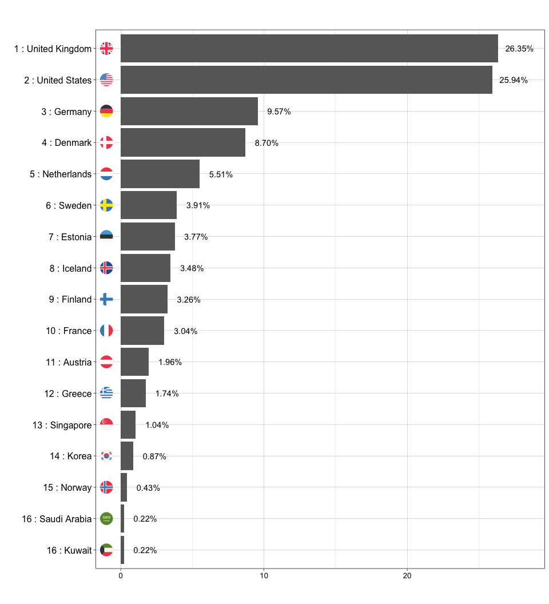

affiliations_example
================
Hugo Fitipaldi
2022-05-06

### Retrieving country of affiliations with the affiliation toolset

In order to start retrieving affiliations from studies published in
PUBMED, there are two ways to load the functions that will be needed.
The first is by downloading this repository and using the command

    source("affiliation_functions.R")

The other is by installing the development version of our
<a href = https://github.com/hugofitipaldi/affiliation> affiliation
package</a>:

    install.packages("remotes")
    remotes::install_github("hugofitipaldi/affiliation")

For future reference, while the code in the `hugofitipaldi/affiliation`
repository will continually evolve, the one contained here won’t suffer
any major changes.

#### Example (publications \> 2014)

``` r
result <- get_affiliations(30297969)
head(result)
```

    ##   author_lastname author_firstname
    ## 1         Mahajan           Anubha
    ## 2          Taliun           Daniel
    ## 3         Thurner         Matthias
    ## 4       Robertson           Neil R
    ## 5          Torres          Jason M
    ## 6          Rayner        N William
    ##                               country_of_affiliation
    ## 1             United Kingdom_United Kingdom_NA_NA_NA
    ## 2                          United States_NA_NA_NA_NA
    ## 3             United Kingdom_United Kingdom_NA_NA_NA
    ## 4             United Kingdom_United Kingdom_NA_NA_NA
    ## 5                         United Kingdom_NA_NA_NA_NA
    ## 6 United Kingdom_United Kingdom_United Kingdom_NA_NA
    ##                                                                                                                                                                                                                                                                                                     affiliation_freetext
    ## 1                              Wellcome Centre for Human Genetics, Nuffield Department of Medicine, University of Oxford, Oxford, UK. anubha@well.ox.ac.uk._Oxford Centre for Diabetes, Endocrinology and Metabolism, Radcliffe Department of Medicine, University of Oxford, Oxford, UK. anubha@well.ox.ac.uk._NA_NA_NA
    ## 2                                                                                                                                                                                               Department of Biostatistics and Center for Statistical Genetics, University of Michigan, Ann Arbor, MI, USA._NA_NA_NA_NA
    ## 3                                                                          Wellcome Centre for Human Genetics, Nuffield Department of Medicine, University of Oxford, Oxford, UK._Oxford Centre for Diabetes, Endocrinology and Metabolism, Radcliffe Department of Medicine, University of Oxford, Oxford, UK._NA_NA_NA
    ## 4                                                                          Wellcome Centre for Human Genetics, Nuffield Department of Medicine, University of Oxford, Oxford, UK._Oxford Centre for Diabetes, Endocrinology and Metabolism, Radcliffe Department of Medicine, University of Oxford, Oxford, UK._NA_NA_NA
    ## 5                                                                                                                                                                                                     Wellcome Centre for Human Genetics, Nuffield Department of Medicine, University of Oxford, Oxford, UK._NA_NA_NA_NA
    ## 6 Wellcome Centre for Human Genetics, Nuffield Department of Medicine, University of Oxford, Oxford, UK._Oxford Centre for Diabetes, Endocrinology and Metabolism, Radcliffe Department of Medicine, University of Oxford, Oxford, UK._Department of Human Genetics, Wellcome Trust Sanger Institute, Hinxton, UK._NA_NA

``` r
split_into_multiple <- function(column, pattern = ", ", into_prefix){
  cols <- str_split_fixed(column, pattern, n = Inf)
  cols[which(cols == "")] <- NA
  cols <- tibble::as_tibble(cols)
  m <- dim(cols)[2]
  
  names(cols) <- paste(into_prefix, 1:m, sep = "_")
  return(cols)
}

n_result <- nrow(result)

result_tb <- result %>% 
  mutate(author_fullname = paste0(author_firstname, " ", author_lastname)) %>%
  bind_cols(split_into_multiple(.$country_of_affiliation, "_", "country_of_affiliation")) %>% 
  # selecting those that start with 'type_' will remove the original 'type' column
  select(c(author_fullname, affiliation_freetext), starts_with("country_of_affiliation_")) 
```

    ## Warning: The `x` argument of `as_tibble.matrix()` must have unique column names if `.name_repair` is omitted as of tibble 2.0.0.
    ## Using compatibility `.name_repair`.
    ## This warning is displayed once every 8 hours.
    ## Call `lifecycle::last_lifecycle_warnings()` to see where this warning was generated.

``` r
result_tb <- result_tb %>%
  gather(key, country_name, -c(author_fullname, affiliation_freetext), na.rm = T)

# A few snippets of code that might help to find any errors 
result_tb %>%
  filter(str_count(country_name, " ") > 2)
```

    ## [1] author_fullname      affiliation_freetext key                 
    ## [4] country_name        
    ## <0 rows> (or 0-length row.names)

``` r
result_tb[str_detect(result_tb$country_name, ", "),]
```

    ## [1] author_fullname      affiliation_freetext key                 
    ## [4] country_name        
    ## <0 rows> (or 0-length row.names)

``` r
library(ggflags)
library(countrycode)
library(ggplot2)

freq_tbl <- result_tb %>%
  filter(country_name != "NA") %>%
  add_count(author_fullname, name = 'name_occurence') %>%
  mutate(country_weighted = 1/name_occurence) %>%
  group_by(country_name) %>%
  dplyr::summarise(prop_country = sum(country_weighted)/n_result * 100) %>%
  ungroup()

freq_tbl$ISO2 <- countrycode(freq_tbl$country_name, origin = 'country.name', destination = 'iso2c')

freq_tbl %>%
  mutate(rank = min_rank(desc(prop_country)), Country_Rank = paste(rank, ":", country_name)) %>%
  ggplot(aes(x = reorder(Country_Rank, prop_country), y = prop_country)) +
  geom_bar(stat="identity", fill="dimgray") +
  labs(title = "", subtitle = "", x = "", y = "",
       caption = "") +
  theme_linedraw() +
  geom_flag(y = -1, aes(country = tolower(ISO2)), size = 7) +
  scale_y_continuous(expand = c(0.02, 1.2)) +
  geom_text(aes(reorder(Country_Rank, prop_country), prop_country + 1.5, label = paste0(sprintf("%2.2f", prop_country), "%")), 
            position = position_dodge(width = 1)) + 
  coord_flip() +
  theme(axis.text.x= element_text(colour = "black",  size = 10),
        axis.text.y = element_text(colour = "black",  size = 12),
        strip.text = element_text(size = 16)) 
```

<!-- -->

The resulting dataframe has the surname and name of each author, the
predicted countries of affiliation and the original affiliation
free-text string from PUBMED.

#### Example (publications \< 2014)
