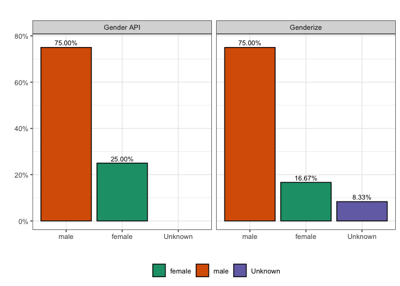

Hugo Fitipaldi
2022-05-22

-   <a href="#genderizeio" id="toc-genderizeio">genderize.io</a>

### GenderAPI

``` r
myKey = "YOUR_GENDERAPI_KEY_HERE"
country_codes <- rio::import("../data/function_data/countries_genderAPI.csv")
head(country_codes)
```

    ##   country_code  country_name
    ## 1           US United States
    ## 2           BE       Belgium
    ## 3           ES         Spain
    ## 4           BH       Bahrain
    ## 5           FR        France
    ## 6           DE       Germany

``` r
result <- get_affiliations(29695241)

authors_df <- result %>%
  mutate(first_affiliation  = str_split(country_of_affiliation, "\\_", simplify=T)[,1]) %>%
  select(author_lastname, author_firstname, first_affiliation)

authors_df$author_firstname <- gsub("\\W*\\b\\w\\b\\W*", " ", authors_df$author_firstname) # Removes abbreviation names
authors_df$author_firstname <- gsub("^\\s+", "", authors_df$author_firstname) # removes leading white space
authors_df$author_firstname <- gsub("^(.*?)\\s.*", "\\1", authors_df$author_firstname) # keeps first name

authors_df <- merge(authors_df, country_codes, by.x="first_affiliation", by.y = "country_name", all.x = TRUE)

head(authors_df)
```

    ##   first_affiliation author_lastname author_firstname country_code
    ## 1            Canada        Paterson           Andrew           CA
    ## 2            Canada      Keshavarzi            Sareh           CA
    ## 3           Denmark       Ahluwalia            Tarun           DK
    ## 4           Denmark         Rossing            Peter           DK
    ## 5            France         Charmet           Romain           FR
    ## 6            France        Trégouët  David-Alexandre           FR

``` r
# Initialize an empty data frame
gender_pred <- data.frame()

# Loop and fill the table
for (i in 1:nrow(authors_df)) {
  tryCatch({
    if (authors_df$first_affiliation[i] != ""){
      
      # Save result
      result <- get_gender(name = authors_df$author_firstname[i], authors_df$country_code[i], api_key = myKey, last_name = authors_df$author_lastname[i])
      
      # Append to the existing table
      gender_pred <- rbind(gender_pred, result)
    }
    Sys.sleep(1/100)
  },error=function(e){cat("ERROR :",conditionMessage(e),"\n")})
}

head(gender_pred)
```

    ##        first_name  last_name country gender accuracy
    ## 1          Andrew   Paterson      CA   male      100
    ## 2           Sareh Keshavarzi      CA female      100
    ## 3           Tarun  Ahluwalia      DK   male      100
    ## 4           Peter    Rossing      DK   male       99
    ## 5          Romain    Charmet      FR   male       99
    ## 6 David-Alexandre   Trégouët      FR   male      100

## genderize.io

`GenderGuesser` is an R package for using the genderize.io API created
and maintained by Eamon Caddigan. More info about it
[here](https://git.eamoncaddigan.net/GenderGuesser/log.html).

``` r
library(GenderGuesser)
genderizeKey <- "YOUR_GENDERIZEAPI_KEY_HERE"
```

``` r
# Initialize an empty data frame
genderize_pred <- data.frame()
# Loop and fill the table
for (i in 1:nrow(authors_df)) {
  tryCatch({
    if (authors_df$author_firstname[i] != ""){
      
      # Save result
      result <- GenderGuesser::guessGender(nameVector = authors_df$author_firstname[i], countryCode = authors_df$country_code[i], apiKey = genderizeKey)
      
      # Append to the existing table
      genderize_pred <- rbind(genderize_pred, result)
    }
    Sys.sleep(1/100)
  },error=function(e){cat("ERROR :",conditionMessage(e),"\n")})
}

genderize_pred %>%
  select(name, country_id, gender, probability)
```

    ##               name country_id gender probability
    ## 1           Andrew         CA   male        1.00
    ## 2            Sareh         CA   <NA>        0.00
    ## 3            Tarun         DK   male        1.00
    ## 4            Peter         DK   male        1.00
    ## 5           Romain         FR   male        0.99
    ## 6  David-Alexandre         FR   male        1.00
    ## 7            Beata         FR female        0.99
    ## 8           Michel         FR   male        0.98
    ## 9             Samy         FR   male        0.96
    ## 10          Seamus         GB   male        1.00
    ## 11             Amy         GB female        1.00
    ## 12       Alexander         GB   male        1.00

### Plots

``` r
library(ggplot2)

genderAPI <- gender_pred %>%
  group_by(gender) %>%
  tally(name = "count_authors") %>%
  ungroup() %>%
  mutate(total_authors = sum(count_authors), prop_gender = count_authors/total_authors, plataform = "genderAPI") 

genderizeio <- genderize_pred %>%
  group_by(gender) %>%
  tally(name = "count_authors") %>%
  ungroup() %>%
  mutate(total_authors = sum(count_authors), prop_gender = count_authors/total_authors, gender =  ifelse(gender == "", "Unknown", gender), plataform = "genderize.io")

gender_df <- rbind(genderAPI, genderizeio)

gender_df %>% 
  ggplot(aes(x = reorder(gender, desc(prop_gender)), y =  prop_gender, fill = gender)) +
  geom_bar(stat = "identity", position = position_dodge(), color = "black") +
  labs(x = "", fill = "", color = "", y = "", title = '') +
  scale_y_continuous(labels = function(x) paste0(x*100, "%")) +
  theme_bw() +
  theme(plot.title = element_text(size = 16),
        legend.position = "bottom") +
  geom_text(aes(x = reorder(gender, desc(prop_gender)), y =  prop_gender + 0.02, label = paste0(sprintf("%2.2f", prop_gender * 100), "%")), 
            position = position_dodge(width = 1), size = 3) +
  scale_fill_brewer(palette="Dark2") +
  facet_wrap(~plataform)
```

<!-- -->
