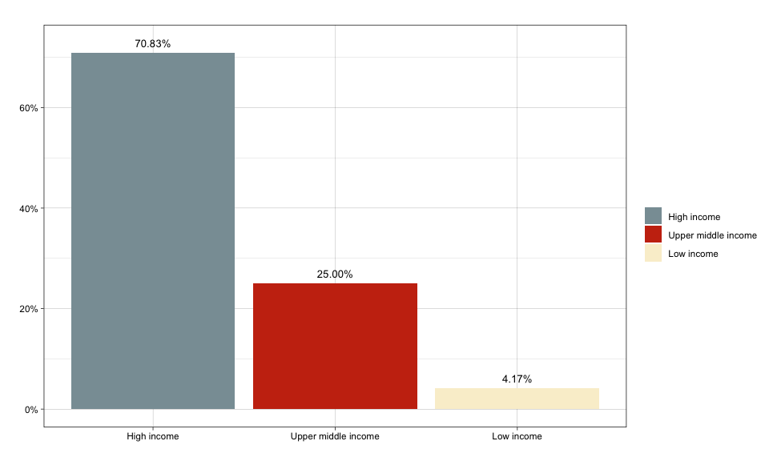

Income analysis - based on country of affiliation
================
Hugo Fitipaldi
2022-05-06

#### Pre-processing World Bank data

``` r
world_bank_df <- rio::import("../data/income/world_bank_income_data.xlsx")
world_bank_df$X <- NULL
world_bank_df <- world_bank_df[,c(1,4)]
world_bank_df[world_bank_df$Economy == "Gambia, The",]$Economy <- "The Gambia"
world_bank_df[world_bank_df$Economy == "Croatia",]$Economy <- "Republic of Croatia"
world_bank_df[world_bank_df$Economy == "Iran, Islamic Rep.",]$Economy <- "Iran"
world_bank_df[world_bank_df$Economy == "Russian Federation",]$Economy <- "Russia"
world_bank_df[world_bank_df$Economy == "Korea, Rep.",]$Economy <- "South Korea"
world_bank_df[world_bank_df$Economy == "Slovak Republic",]$Economy <- "Slovakia"
world_bank_df[world_bank_df$Economy == "Syrian Arab Republic",]$Economy <- "Syria"
world_bank_df[world_bank_df$Economy == "Egypt, Arab Rep.",]$Economy <- "Egypt"
world_bank_df[world_bank_df$Economy == "North Macedonia",]$Economy <- "Macedonia"
world_bank_df[world_bank_df$Economy == "Taiwan, China",]$Economy <- "Taiwan"
world_bank_df[world_bank_df$Economy == "Papua New Guinea",]$Economy <- "Papua new Guinea"

names(world_bank_df) <- c("Economy", "Income_group")
head(world_bank_df)
```

    ##          Economy        Income_group
    ## 1    Afghanistan          Low income
    ## 2        Albania Upper middle income
    ## 3        Algeria Lower middle income
    ## 4 American Samoa Upper middle income
    ## 5        Andorra         High income
    ## 6         Angola Lower middle income

#### Loading and processing PubMed data

More details of the `get_affiliation` function is give in the
`affiliation_example.md` notebook.

``` r
result <- get_affiliations(35015074)
n_result <- nrow(result)

split_into_multiple <- function(column, pattern = ", ", into_prefix){
  cols <- str_split_fixed(column, pattern, n = Inf)
  cols[which(cols == "")] <- NA
  cols <- tibble::as_tibble(cols)
  m <- dim(cols)[2]
  
  names(cols) <- paste(into_prefix, 1:m, sep = "_")
  return(cols)
}

result_tb <- result %>% 
  mutate(author_fullname = paste0(author_firstname, " ", author_lastname)) %>%
  bind_cols(split_into_multiple(.$country_of_affiliation, "_", "country_of_affiliation")) %>% 
  # selecting those that start with 'type_' will remove the original 'type' column
  select(c(author_fullname, affiliation_freetext), starts_with("country_of_affiliation_"))  %>%
  gather(key, country_name, -c(author_fullname, affiliation_freetext), na.rm = T) 

freq_tbl <- result_tb %>%
  filter(country_name != "NA") %>%
  merge(world_bank_df, by.x = "country_name", by.y = "Economy", all.x = TRUE)

freq_tbl %>%
  select(country_name, Income_group)
```

    ##      country_name        Income_group
    ## 1    South Africa Upper middle income
    ## 2    South Africa Upper middle income
    ## 3    South Africa Upper middle income
    ## 4    South Africa Upper middle income
    ## 5          Uganda          Low income
    ## 6  United Kingdom         High income
    ## 7  United Kingdom         High income
    ## 8  United Kingdom         High income
    ## 9  United Kingdom         High income
    ## 10 United Kingdom         High income
    ## 11 United Kingdom         High income
    ## 12  United States         High income
    ## 13  United States         High income
    ## 14  United States         High income
    ## 15  United States         High income

``` r
library(ggplot2)
library(wesanderson)

freq_tbl %>%
  add_count(author_fullname, name = 'name_occurence') %>%
  mutate(income_weighted = 1/name_occurence) %>%
  group_by(Income_group) %>%
  dplyr::summarise(prop_income = sum(income_weighted)/n_result * 100) %>%
  ungroup() %>%
  ggplot(aes(x = reorder(Income_group, desc(prop_income)), y =  prop_income, fill = reorder(Income_group, desc(prop_income)))) +
  geom_bar(stat = "identity", position = position_dodge()) +
  scale_y_continuous(labels = function(x) paste0(x, "%")) +
  theme_linedraw() +
  labs(x = "", fill = "", color = "", y = "", title = '') +
  geom_text(aes(x = reorder(Income_group, desc(prop_income)), y =  prop_income + 2, label = paste0(sprintf("%2.2f", prop_income), "%")), 
            position = position_dodge(width = 1), size = 3.5, color = "black") +
  scale_fill_manual(values = wes_palette("Royal1"))
```

<!-- -->
